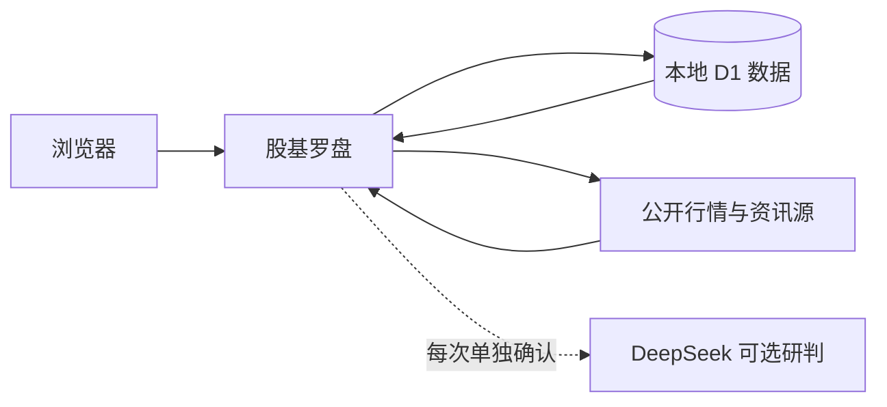

<div align="center">
  
  <h1>股基罗盘</h1>
  <p><strong>把持仓、行情、资讯与 AI 研判收进一个克制的私人研究工作台</strong></p>
  <p>覆盖 A 股、ETF、场外基金与美股观察；坚持真实数据、来源可追溯、缺失不造数。</p>
  <p>
    
    
    
    
    
  </p>
  <p>
    <a href="#-快速开始">快速开始</a> ·
    <a href="#-功能地图">功能地图</a> ·
    <a href="#-deepseek-研判">DeepSeek</a> ·
    <a href="#-隐私边界">隐私边界</a> ·
    <a href="./docs/使用说明.md">完整使用说明</a>
  </p>
</div>

> [!IMPORTANT]
> 本项目只供个人研究参考，不构成投资建议或交易指令。关键信息请回到公告与数据源原文核验。

## ✨ 为什么做它

常见行情软件擅长展示市场，却很少围绕“我实际持有什么、风险在哪里、明天先看什么”组织信息。股基罗盘把这些线索放到同一张研究桌面上：

- **数据不够就直说**：不补演示数字，不伪造行情、趋势或结论。
- **来源状态可见**：展示更新时间、覆盖范围、单源、多源验证与来源冲突。
- **分析落到持仓**：不是泛泛聊大盘，而是逐只说明观察点、风险和动作条件。
- **敏感信息少外流**：成本、数量、金额、流水和账号信息不发送给 DeepSeek。
- **桌面与手机都能用**：保持紧凑的信息密度，同时兼顾小屏操作。

## 🚀 快速开始

要求 Node.js `>=22.13.0`。

```bash
git clone https://github.com/maeheelam-beep/stock-analysis-assistant.git
cd stock-analysis-assistant
npm ci
```

复制环境变量模板：

```powershell
# Windows PowerShell
Copy-Item .env.example .env.local
```

```bash
# macOS / Linux
cp .env.example .env.local
```

启动项目：

```bash
npm run dev
```

打开 [`http://localhost:3000/`](http://localhost:3000/)，注册账号后即可添加持仓。首次运行会自动准备本地 D1 数据表。

> [!TIP]
> 不配置 DeepSeek 也能使用持仓、行情、资讯、历史、风险和本地证据包；只有“AI 分析”不可用。

## 🧭 功能地图

| 区域 | 能做什么 | 数据原则 |
| --- | --- | --- |
| **首页** | 汇总资产、今日/累计盈亏、仓位与持仓状态 | 缺失行情留空，不补零 |
| **行情** | 四大指数、涨跌榜、成交额榜、市场宽度、行业热力图 | 多源核验并标注冲突 |
| **股票** | 持仓、自选、历史走势、估值、财报摘要、量化风险 | 免费公开源，来源可追溯 |
| **基金** | 产品与经理档案、重仓重叠、净值历史相似 | 只使用公开披露数据 |
| **资讯** | 市场快讯、政策信息、持仓公告 | 聚合标题与原文入口 |
| **美股** | 三大指数、自选、热门/涨跌榜 | 只观察，不并入持仓分析 |
| **流水** | 买卖、分红、费用、期初记录与 FIFO 成本批次 | 随账号私有保存 |
| **AI 研判** | 下一交易日倾向、三种概率、逐只动作与观察条件 | 每次确认后才匿名发送 |

<details>
<summary><strong>展开查看更完整的数据能力</strong></summary>

- A 股与 ETF 行情由东方财富、腾讯等免费公开源交叉核验。
- 股票排行由新浪财经主供、东方财富备用，每类最多显示 20 条。
- 市场宽度优先使用 500 只成交活跃股票的动态样本。
- 行业热力图展示涨幅前 24 与跌幅前 24，共 48 个动态样本。
- 个股估值覆盖 PE(TTM)、PB、PS(TTM)、总市值及最新公开财报摘要。
- 历史研究覆盖相似形态、年化波动率、最大回撤、VaR95、胜率与最长连跌。
- 基金研究覆盖经理档案、最新定期报告前十大持仓、重仓重叠与净值历史。
- 新闻聚合保留各来源原文链接，同一事件可合并但不会丢失出处。

</details>

## 🤖 DeepSeek 研判

DeepSeek 是可选能力。API Key 不在仓库中，使用者需要自行写入被 Git 忽略的 `.env.local`。

<details>
<summary><strong>方式一：本地直连</strong></summary>

```dotenv
DEEPSEEK_API_KEY=你的真实APIKey
DEEPSEEK_MODEL=deepseek-v4-flash
```

</details>

<details>
<summary><strong>方式二：使用已有的 HTTPS 中转地址</strong></summary>

```dotenv
DEEPSEEK_API_KEY=
DEEPSEEK_MODEL=deepseek-v4-flash
DEEPSEEK_RELAY_URL=https://你的中转域名/v1/chat/completions
DEEPSEEK_RELAY_TOKEN=独立的中转口令
```

中转地址必须使用 HTTPS，且不能在 URL 中包含用户名或密码。配置中转地址后，应用会优先使用中转。

</details>

每次 AI 研判都需要单独确认。系统会综合持仓行情、指数、市场宽度、行业、资讯、公告、基本面、基金档案、历史与风险数据，再输出：

1. 下一交易日更可能偏涨、震荡、偏跌或看不清；
2. 上涨、震荡、下跌三种主观概率；
3. 最需要关注的具体持仓与开盘观察点；
4. 每只持仓的参考动作、原因和触发条件；
5. 本轮证据覆盖、来源与缺失项。

## 🔐 隐私边界

| 场景 | 会使用 | 不会使用 |
| --- | --- | --- |
| **证券搜索** | 本次输入的代码或名称关键词 | 成本、数量、金额、账号信息 |
| **行情/基金/公告** | 查询所需的证券代码 | 持仓数字、设备标识 |
| **DeepSeek** | 匿名编号、占比、取整后的涨跌/收益、匿名研究摘要、公开市场数据 | 证券代码、名称、成本、数量、金额、流水、Cookie |
| **美股自选** | 自选代码与名称 | A 股/基金持仓或 AI 分析输入 |

> [!WARNING]
> “复制数据明细 JSON（完整）”可能包含真实持仓信息。请只保存在可信位置，不要粘贴到公开 Issue、Pull Request、聊天或提交记录中。

## 🧱 数据流一览



## 🧪 质量检查

```bash
npm run lint
npm run build
node --test
```

也可以运行 `npm test`，它会先完成生产构建，再执行全部测试。当前基线为 **29 项测试通过**。

## 📁 项目结构

```text
app/           页面、交互与 API 路由
db/            D1 / Drizzle 数据访问
drizzle/       数据表迁移
lib/           行情、资讯、研究、风险与存储逻辑
public/        静态资源
tests/         回归测试
docs/          使用文档
worker/        Cloudflare Worker 入口
```

## 🤝 参与贡献

1. Fork 仓库并从 `main` 创建功能分支；
2. 保持数据真实、来源透明、缺失不造数；
3. 修改后运行 lint、构建和测试；
4. 提交清晰的变更说明并发起 Pull Request。

请勿提交 `.env.local`、真实 API Key、Cookie、账号资料、持仓数据、日志或完整本地证据包。

## 🗺️ 仍在完善

- 更完整的财报、估值字段与基金持仓穿透；
- 商业级全量行情、板块资金与主力资金；
- 管理工具、备份与费用监控。

---

<div align="center">
  <strong>看清数据，再做决定。</strong><br />
  <sub>股基罗盘 V1.3.32 · 个人研究工具</sub>
</div>
